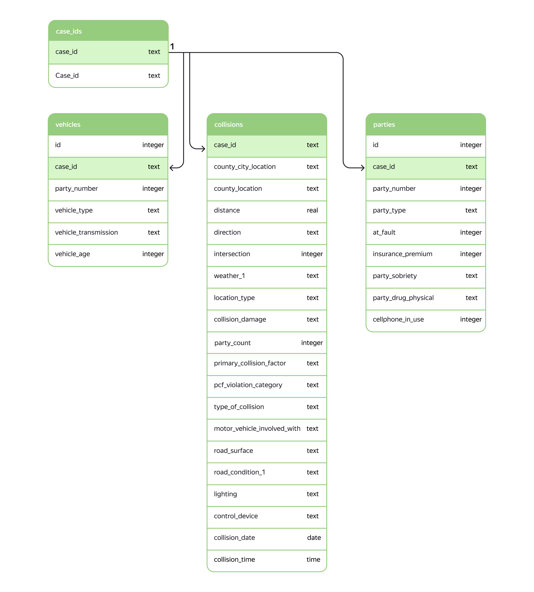

# Модель оценки риска ДТП
**Задача:** нужно создать систему, которая могла бы оценить риск ДТП по выбранному маршруту движения. Под риском в данном случае понимается вероятность ДТП с любым повреждением транспортного средства. Как только водитель забронировал автомобиль, сел за руль и выбрал маршрут, система должна оценить уровень риска. Если уровень риска высок, водитель увидит предупреждение и рекомендации по маршруту. \
Для анализа риска создается модель, предсказывающая возможность попадания водителя в аварию. Модель - бинарной классификации. Отбираются и анализируются основные факторы, влияющие на модель.
Данные отбираются из базы данных посредством sql-запроса. \
Структура базы данных: \

Краткое описание таблиц: 
* collisions — общая информация о ДТП
Имеет уникальный case_id. Эта таблица описывает общую информацию о ДТП. Например, где оно произошло и когда.
* parties — информация об участниках ДТП
Имеет неуникальный case_id, который сопоставляется с соответствующим ДТП в таблице collisions. Каждая строка здесь описывает одну из сторон, участвующих в ДТП. Если столкнулись две машины, в этой таблице должно быть две строки с совпадением case_id. Если нужен уникальный идентификатор, это case_id and party_number.
* vehicles — информация о пострадавших машинах
Имеет неуникальные case_id и неуникальные party_number, которые сопоставляются с таблицей collisions и таблицей parties. Если нужен уникальный идентификатор, это case_id and party_number.
